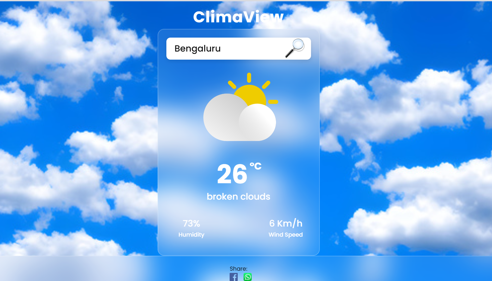

## ClimaView
ClimaView is a web application designed to provide weather information for any location. The application allows users to search for their location and view current weather conditions, including temperature, humidity, and wind speed.

## Features
Search Functionality: Enter your location to get the current weather details.
Weather Information: Displays temperature, description, humidity, and wind speed.
Error Handling: Shows a 404 error image if the location is not found.
Social Sharing: Share the weather information on Facebook and WhatsApp.

## Screenshots

Main Page Preview

Main Screen with Search and Weather Information

## Installation
To run ClimaView locally, follow these steps:

Clone the repository:

bash
Copy code
git clone https://github.com/neha-annie/climaview.git
Navigate to the project directory:

bash
Copy code
cd climaview

Check out page preview at https://nehaannie.github.io/climaview.github.io/

## Technologies Used
HTML: Structure of the web page
CSS: Styling of the web page
JavaScript: Functionality for search and social sharing

## Usage
Open index.html in a web browser.
Enter a location in the search box and click the search button.
View the current weather details and other relevant information.
Social Sharing
Facebook: Click the Facebook icon to share the weather information on Facebook.
WhatsApp: Click the WhatsApp icon to share the weather information on WhatsApp.

## Contributing
If you want to contribute to ClimaView, feel free to fork the repository and submit a pull request. For major changes, please open an issue first to discuss what you would like to change.

## Contact
If you have any questions or suggestions, feel free to reach out to your-nehaannie2002@gmail.com
